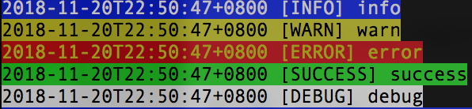

# shell-utils

Common utils for bash

[](https://travis-ci.org/beyondops/shell-utils)

<!-- TOC -->

- [shell-utils](#shell-utils)
    - [Usage](#usage)
    - [Modules](#modules)
        - [Log](#log)
        - [Timer](#timer)

<!-- /TOC -->

## Usage

```bash
#!/bin/bash
set -eu
readonly SBIN="$(cd "$(dirname "${BASH_SOURCE[0]}")" && pwd)"
cd "$SBIN"
readonly DEBUG=1
source ./utils.sh
```

## Modules

### Log

- log::info
- log::warn
- log::error
- log::success
- log::debug

__Example:__

```bash
log::info info
log::warn warn
log::error error
log::success success
log::debug debug
```

__Output:__



### Timer

- time::start
- time::step_time

__Example:__

```bash
time::start "Start app"
sleep 1
time::step_time
sleep 1
time::step_time "Finish step"
```

__Output:__

```bash
2018-11-20T22:40:49+0800 [INFO] [TIME] [start] Start app
2018-11-20T22:40:50+0800 [INFO] [TIME] [step: 0d-0h-0m-1s, total: 0d-0h-0m-1s]
2018-11-20T22:40:51+0800 [INFO] [TIME] [step: 0d-0h-0m-1s, total: 0d-0h-0m-2s] Finish step
```
